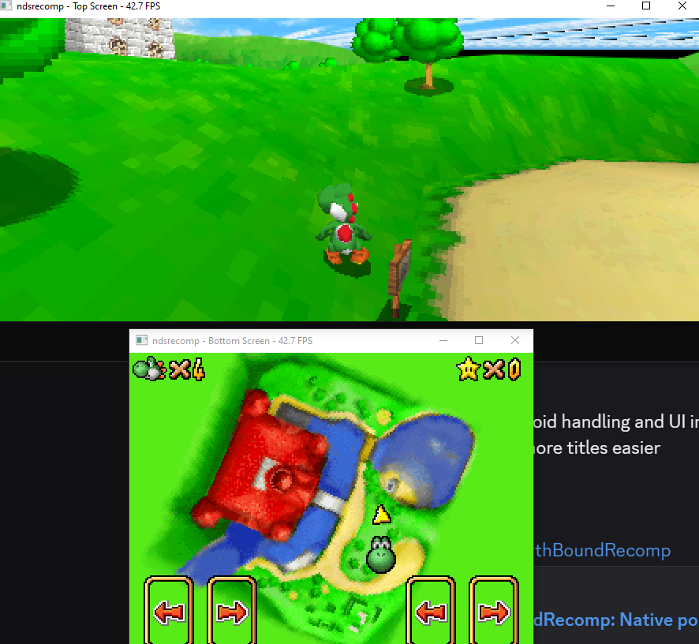
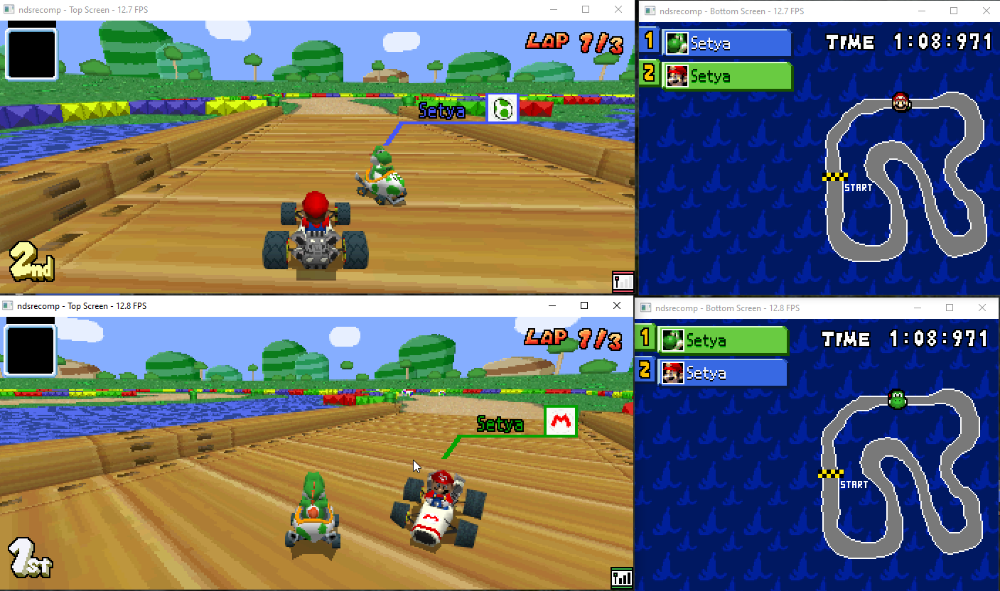
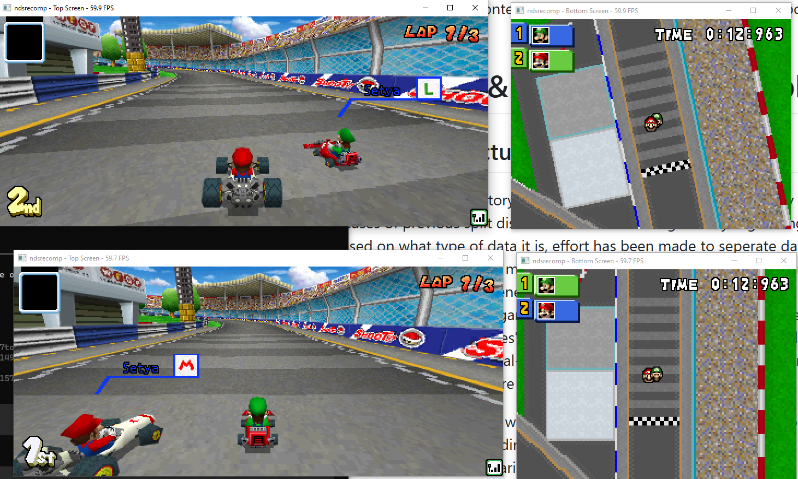

# ndsrecomp

> ## Status: very early pre-alpha (v0.0.1)
>
> This is an experimental developer snapshot, not a ready-to-use emulator or
> a stable framework. It has demonstrated one specific, hash-verified Nintendo
> DS firmware path, early title bring-up across multiple games, experimental
> online play through Wiimmfi, and same-machine local wireless multiplayer. It
> has no compatibility promise, no stable API, and no turnkey clean-clone game
> build yet. Internals and instructions may change without notice.

ndsrecomp is a static recompiler for the **Nintendo DS**. In the same family
as `nesrecomp`, `snesrecomp`, `psxrecomp`, `segagenesisrecomp`, and
`gbarecomp`, it lifts guest ARM code to C ahead of time and runs that code
natively rather than interpreting the immutable banks.

This is **not** a general-purpose emulator. A thin runtime supplies the memory
bus, two-CPU scheduling, hardware models, and optional SDL presentation. Code
copied into RAM by the guest currently uses a bounded interpreter tier.

## Current demonstrated targets

The original DS firmware menu remains the baseline target: boot through the
ARM7 and ARM9 BIOSes, pass the Health & Safety screen, reach the main menu, and
interact with it through mouse-driven touch input.

The first experimental game target was a locally supplied European revision-0
Super Mario 64 DS dump. Mario Kart DS now demonstrates real Wiimmfi online
matching and experimental same-machine local wireless multiplayer. Metroid
Prime Hunters has early gameplay footage and title-specific 21:9 display
bring-up. These are narrow bring-up results, not broad compatibility claims.

Current source release: **[v0.0.1](https://github.com/mstan/ndsrecomp/releases/tag/v0.0.1)**.

## Showcase

Prime Hunters early gameplay footage:
**[watch on YouTube](https://www.youtube.com/watch?v=tvqnW6J6KU0)**.

| Super Mario 64 DS adaptive 21:9 | Mario Kart DS local wireless | Mario Kart DS Wiimmfi |
|---|---|---|
|  |  |  |

## What currently works

- ARM7TDMI (ARMv4T) and ARM946E-S (ARMv5TE) decode and C emission.
- A dual-CPU, event-aligned scheduler and the hardware paths exercised by the
  tested firmware-menu and SM64DS title traversals.
- Physical-card-style command, secure-area/KEY1, DMA, and firmware launch
  behavior for the demonstrated local game dump.
- Interactive SDL video, touch, keyboard, and paced stereo audio in the tested
  developer build.
- Title-owned adaptive widescreen presentation for audited upper-screen 3D
  scenes.
- Experimental Nintendo WFC plumbing for title projects, demonstrated with
  Mario Kart DS reaching Wiimmfi multiplayer.
- Experimental same-machine local wireless multiplayer for MKDS through a
  localhost transport. LAN/across-machine play is not validated or claimed.
- A separate melonDS-based accuracy oracle and machine-readable traversal
  evidence for differential testing.

Important limitations:

- SM64DS, Mario Kart DS, and Prime Hunters are separate title repositories with
  their own exact-ROM gates, generated banks, and release status. This
  framework repository does not ship turnkey game builds.
- Prime Hunters gameplay is early footage, not a compatibility claim.
- The checked-in tree intentionally omits generated recompiled banks, because
  they contain code derived from user-provided Nintendo dumps.
- Building the demonstrated targets requires local BIOS, firmware, ROM, and
  generated-bank inputs. The developer-oriented regeneration workflow is not
  yet turnkey from a clean clone.
- Documentation outside this README is primarily internal development material.

## The DS is two CPUs

| | core | ISA | clock | role |
|---|---|---|---|---|
| **ARM9** | ARM946E-S | ARMv5TE | ~67 MHz | main; caches, MPU, TCM, CP15; runs the menu GUI |
| **ARM7** | ARM7TDMI | ARMv4T | ~33 MHz | sub; touch/SPI, sound, RTC, Wi-Fi |

They share 4 MB of main RAM and communicate through IPC FIFO and IPCSYNC. The
runtime interleaves both CPUs on one event scheduler.

ARM7 uses the same core family as the GBA, so the portable ARM core began as a
port of the sibling `gbarecomp/src/armv4t` implementation. ARM9 adds the
ARMv5TE instructions and CP15 system-control behavior. See
[`THIRD_PARTY_ATTRIBUTION.md`](THIRD_PARTY_ATTRIBUTION.md) for provenance and
licensing boundaries.

## User-provided inputs

You must dump these files from hardware you own and place them in `bios/`.
They are hash-verified at load and are ignored by Git.

| file | SHA-1 | role |
|---|---|---|
| `biosnds9.rom` | `bfaac75f101c135e32e2aaf541de6b1be4c8c62d` | ARM9 BIOS (4 KB, maps at `0xFFFF0000`) |
| `biosnds7.rom` | `24f67bdea115a2c847c8813a262502ee1607b7df` | ARM7 BIOS (16 KB, maps at `0x00000000`) |
| `firmware.bin` | `ae22de59fbf3f35ccfbeacaeba6fa87ac5e7b14b` | 256 KB flash image used by the demonstrated path |

`BIOSGBA.ROM` is reserved for possible future GBA-mode work and is out of
scope. More detail is in [`bios/README.md`](bios/README.md).

## Oracle

The accuracy oracle is a separately built process based on
[melonDS](https://github.com/melonDS-emu/melonDS), pinned to tag `1.0rc` for
the retained evidence. It is optional and never links into the native runner.
DeSmuME is used as a secondary behavioral cross-check. See
[`oracle/README.md`](oracle/README.md) and
[`THIRD_PARTY_ATTRIBUTION.md`](THIRD_PARTY_ATTRIBUTION.md).

## Layout

```text
recompiler/   ARM/Thumb/ARMv5 decode -> IR -> C codegen; function finder
runner/       dual-CPU scheduler, bus, CP15, I/O, 2D engines, SDL host
generated/    local recompiled banks and dispatch tables (ignored)
bios/         user-provided dumps (ignored) and tracked address configs
oracle/       separate melonDS oracle glue, patches, and comparison tools
tools/        capture, inspection, symbol, and release-verification tools
docs/         internal accuracy, architecture, and bring-up notes
```

## Build from source

The recompiler and its current tests build from a clean clone with CMake 3.20+
and a C++20 compiler. Ninja is used below:

```sh
cmake -G Ninja -B recompiler/build recompiler
cmake --build recompiler/build
./recompiler/build/armv5te_decode_test
./recompiler/build/interpreter_cycle_test
```

After supplying your own dumps, the two immutable BIOS banks can be emitted
locally:

```sh
./recompiler/build/nds_recompile --config bios/biosnds9.toml \
  --bin bios/biosnds9.rom --out generated --bank arm9_bios
./recompiler/build/nds_recompile --config bios/biosnds7.toml \
  --bin bios/biosnds7.rom --out generated --bank arm7_bios
```

The full runner additionally expects firmware RAM-bank captures matching the
configs under `bios/firmware_banks/`. The current capture and regeneration
tools are `tools/capture_firmware_images.py` and
`tools/export_firmware_bank_configs.py`, but this bootstrap workflow still
assumes an active developer setup. Once every required bank exists under
`generated/`, configure and build the runner:

```sh
cmake -G Ninja -B runner/build runner
cmake --build runner/build
```

SDL2 is optional at configure time; without it, the runner is headless and
interactive presentation is unavailable.

### Game-owned static banks

A game project can supply generated main-code banks without adding title names
or dispatch symbols to the shared runner. Configure the runner with the
directory and the exact ROM identity used to generate those banks:

```sh
cmake -G Ninja -S runner -B runner/build-title \
  -DNDS_BOOTSTRAP_FIRMWARE=ON \
  -DNDS_TITLE_BANK_DIR=/path/to/game/generated/recomp \
  -DNDS_TITLE_ROM_SHA1=40-lowercase-hex-digits
cmake --build runner/build-title
```

Dispatch tables are discovered at configure time, classified by `_arm9_` or
`_arm7_` in the bank name, and registered only when the loaded cartridge has
the configured SHA-1. Live-byte validation remains the boundary for mutable
or overlay code.

### Interactive display configuration

The interactive runner reads an optional `game.toml` in its working directory,
or a file selected with `--config <path>`. Host display settings live in a
separate table so recompilation and hardware-parity configuration remain
independent:

```toml
[game]
sha1 = "40-lowercase-hex-digits"

[display]
screen_layout = "stacked"          # stacked | separate
adaptive_widescreen = "none"       # none | top | bottom | both
adaptive_capability = "top"        # exact-ROM capability; same choices
adaptive_width = 448               # even width from 256 through 448
adaptive_skybox_fill = false       # optional title-audited repair
adaptive_hud_anchor = false        # title-audited text HUD band placement
adaptive_hud_center_width = 64     # centered source band; multiple of 8

[system]
startup_mode = "preserve"          # preserve | manual | automatic

[cartridge]
save_type = "eeprom"                # none | eeprom-tiny | eeprom | flash
save_size = 8192                    # bytes; nonzero power of two
```

`screen_layout = "separate"` creates independently movable top and bottom
windows. Pointer input is accepted only from the physical bottom-screen
window; keyboard input remains shared by the DS session. Adaptive widescreen
is a title capability, not framebuffer stretching: unsupported screen choices
are rejected. A title may expose the top screen, bottom screen, or both
independently. The native 256x192 compositor remains the parity path; adaptive
output is opt-in. The default `auto` renderer policy prefers the OpenGL 4.3
compute backend and its direct GPU-resident adaptive path when eligible, with
startup fallback to threaded software. `NDS_3D_RENDERER=soft` forces the
faithful floor; `NDS_3D_RENDERER=compute` forces OpenGL and fails loudly if it
cannot start. HUD sprites can be anchored to the widened left/right corners
while center overlays remain centered. `adaptive_capability` requires an exact
`[game].sha1`, allowing new
title projects to opt into audited screens without adding their ROM hashes to
the framework. `adaptive_skybox_fill` remains off unless a title explicitly
needs and audits the cylindrical-sky repair heuristic. The equivalent one-run
`adaptive_hud_anchor` permits transparent text-tile HUD planes to be split
into authored left, center, and right bands over the wide 3D scene; affine,
bitmap, and windowed layouts still fail closed.
`adaptive_hud_center_width` keeps wider centered assemblies such as location
names and energy bars intact while the remaining bands move outward. The
equivalent one-run
overrides are
`NDS_SCREEN_LAYOUT` / `NDS_ADAPTIVE_WIDESCREEN` and the
`--screen-layout` / `--adaptive-widescreen` CLI flags. Precedence is TOML,
then environment, then CLI.

`startup_mode = "automatic"` sets the retail firmware's Automatic-mode flag
in the runner's private in-memory firmware image. With a Slot-1 cartridge
inserted, the real BIOS/firmware/card path then launches it without navigating
the menu; this is not direct-boot HLE and never modifies `firmware.bin` on
disk. `manual` forces the DS menu and `preserve` honors the dumped setting.
The one-run overrides are `NDS_STARTUP_MODE` and `--startup-mode`.

Commercial-title projects should declare cartridge save type and capacity
from a trusted cartridge database. Projects without a `[cartridge]` table
retain the historical 8 KiB EEPROM default for compatibility.
When `[game].sha1` is present, the runner rejects a different cartridge before
applying any title-owned display, startup, or save-device settings.

Physical framebuffer routing follows POWCNT1 as scanlines are produced. This
matters for titles such as Prime Hunters that change LCD assignment during
VBlank: applying the current routing only when a completed frame is presented
would retroactively swap that frame.

Whole-machine save states are not implemented yet. The vendored 3D device has
serialization support, but a correct state must atomically include both CPUs,
the scheduler, bus/RAM, DMA/timers/IRQs, 2D and 3D engines, audio, SPI,
cartridge/save devices, and host queues. F1-F12 bindings will be added only
with that complete boundary; partial GPU-only states would silently corrupt a
running game.

## Copyright and licensing

This repository intentionally contains no Nintendo BIOS, firmware, ROM, save
data, generated recompiled code, or binary embedding those materials. The
checked-in showcase images are manually selected demonstration screenshots;
do not add raw captures, save files, generated banks, or dumped game material.

The original code in this repository is released under the MIT License; see
[`LICENSE`](LICENSE). This grant covers only the project's own source. Ported
components and the optional oracle retain their own terms and are **not**
relicensed by it; see
[`THIRD_PARTY_ATTRIBUTION.md`](THIRD_PARTY_ATTRIBUTION.md) for provenance and
licensing boundaries.

## Development rules

See [`PRINCIPLES.md`](PRINCIPLES.md), [`DEBUG.md`](DEBUG.md), and
[`CLAUDE.md`](CLAUDE.md). These are working documents for active development,
not a stable contributor guide.

---

<p align="center">
  <sub><b>R.A.I.D. — Retro AI Development</b> · a Discord community for AI-assisted retro reverse-engineering, decomp &amp; recomp · <a href="https://discord.gg/Ad9BwSzctP">Join the server</a></sub>
</p>
